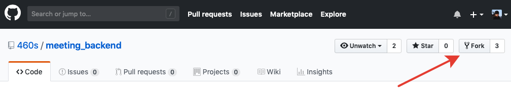
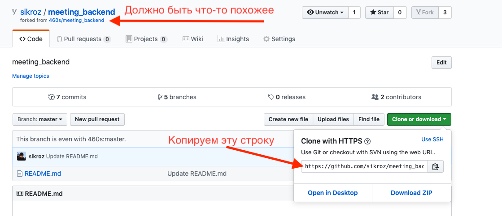

# Подготовка к ДЗ
Делаем fork от этого репозитория кнопка на картинке:


Вас перекинет на новую страницу с вашим личным репозиторием, возможно понадобится регистрация в гитхабе:


Скопировали ссылку на репозиторий, и регаемся в системе рейтинга http://130.193.57.183/ вставляем там ссылку на репозиторий. Система рейтинга пока не дописана (желающие помочь welcome), но в дальнейшем там будет здорово

Как сделаете ДЗ создайте pull-реквест, мы почитаем, напишем комментарии. Pull-реквест надо делать на этот бранч

# Домашнее задание

К следующему занятию нам понадобится библиотека Poco, её сборка занимает некоторое время. Лучше собрать ее дома, поэтому задание на дом следующее:

Используя conanfile
```
[requires]
Poco/1.9.0@pocoproject/stable
jsonformoderncpp/3.3.0@vthiery/stable

[generators]
cmake

[options]
Poco:shared=True
```

Написать программу которая, принимая на stdin строку вида `https://github.com/460s/meeting_backend/edit/hello-conan/README.md`
выводит в stdout json документ вида
```
{
  "schema": "https",
  "host": "github.com",
  "path": "/460s/meeting_backend/edit/hello-conan/README.md"
}
```
Затем выходит

Использовать:
- Как работать с конаном - https://docs.conan.io/en/latest/getting_started.html
- Дока на нужные классы от Poco - https://pocoproject.org/slides/160-URIandUUID.pdf
- Использовать nlohmann::json - https://github.com/nlohmann/json

